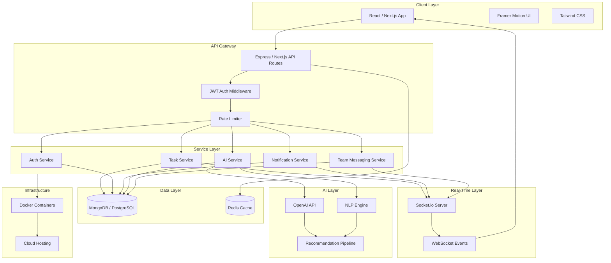
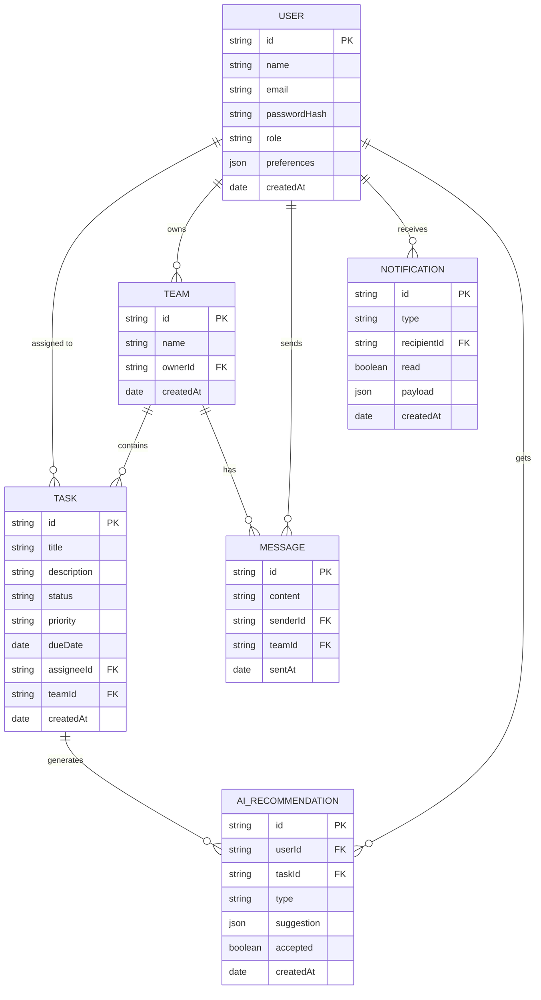

# Prompt: Build an Enterprise AI Platform

## Domain
SaaS / Full-Stack Engineering

## Task Overview
Build a full-stack task management app — real-time collaboration, an AI layer that
actually helps, and security solid enough for a real production environment. The
order of priorities matters: working correctly comes first, then fast, then out of
the way. Don't build things nobody asked for just to pad the feature list.

> A simple, AI-powered task app for teams. Works in real time. Easy to use. No clutter.

---

## Context & Role

You're a full-stack engineer. The goal isn't a demo that looks good in a presentation
— it's an app a team opens on Monday morning and doesn't complain about by Wednesday.
Fast and simple matter more than feature-complete.

The app needs to do these things well:

| What | Why it matters |
|:---|:---|
| Real-time updates | When one person changes something, everyone else sees it — no refresh needed |
| Smooth animations | Moving around the app should feel natural, not sluggish |
| Safe login | The right people get in, wrong ones don't, and sessions don't stay open forever |
| Strong backend | Handles the load now, and doesn't need a full rewrite when it grows |
| Helpful AI | Tips that save time — not noise that people learn to ignore |
| Easy for everyone | Keyboard-navigable, readable contrast, works on a phone |

The goal: something teams open in the morning and don't find annoying by noon.

---

## System Requirements

### System Architecture



### Technology Stack

No strong opinions here on versions, but this is the expected baseline:

**Frontend**
- React.js / Next.js — UI and routing
- Tailwind CSS — styling
- Framer Motion — animations

**Backend**
- Node.js + Express — API server
- Next.js API Routes — serverless alternative

**Database**
- MongoDB or PostgreSQL

**Real-Time**
- Socket.io / WebSockets — live updates

**AI**
- OpenAI API — smart recommendations
- NLP — task categorization

**Deployment**
- Docker + cloud infrastructure

### Frontend Requirements

**Landing Page**

The landing page has one job: get someone into the app. One headline, a clear CTA,
minimal friction. Nobody reads landing page copy on their second visit.

- Hero section with a simple animation — nothing that takes 3 seconds to load
- Smooth scroll between sections
- Onboarding flow that doesn't require a manual

**Dashboard**

This is where most users will spend most of their time. It needs to show the right
information upfront — if someone has to scroll around to understand what's happening
with their team, the layout isn't working.

- Tasks update live when someone changes them
- Activity panel so the team isn't working blind
- Charts that are actually readable, not just decorative

**Task Board**

Core feature. Kanban-style columns, drag and drop between them. Keep it
straightforward — the usual complaints about tools like Trello are mostly about
clutter and slow load times, not the basic concept.

- Add, edit, delete tasks
- Drag between columns: To Do, In Progress, Done
- Priority and due date on each task

**AI Sidebar**

This isn't a chat interface. It's a sidebar that surfaces relevant information —
upcoming deadlines, task priority suggestions, workload imbalances — without asking
the user to prompt it.

- Suggests what to work on next
- Flags tasks that are about to be late
- Light stats: "You closed 8 tasks this week"

**Notifications**

Most notification systems get turned off within a week because they fire too often.
These should only show up for things that actually need attention.

- Live alerts for mentions and changes
- Toast pop-ups that don't block the screen
- `@mention` to pull someone in

**Profile & Settings**

Settings pages are infrastructure, not features. Nobody should need to visit this
more than once to get things the way they want them.

- Time zone, language, notification preferences
- Light or dark theme toggle
- Password change, 2FA setup, active session management

### Layout Requirements

Layout should be invisible. If someone has to figure out where things are, something
went wrong in the design.

| Rule | What it means |
|:---|:---|
| Responsive grid | From 320px to 1440px, nothing should look broken |
| Sticky sidebar | Nav stays anchored while the main content scrolls |
| Mobile first | Design for phones, layer up from there |
| Smart charts | Data viz adapts to container width, doesn't overflow |
| Flexible boxes | No fixed-width containers that break at certain sizes |
| Cards | Consistent padding, radius, and shadow — pick one style and keep it |
| Clean fonts | One type scale. Don't mix font sizes inconsistently across pages. |
| Page changes | Transitions under 300ms, no full-page flicker |

**Responsive Breakpoints**

| Breakpoint | Target Device |
|:---:|:---:|
| `< 640px` | Mobile |
| `640px – 1024px` | Tablet |
| `> 1024px` | Desktop |

### Animation Requirements

Don't animate things just because you can. Each one should have a clear reason — if
it doesn't help the user understand what just happened, it's probably just distraction.

- Content reveals on scroll — sections, not word by word
- Staggered list entry (not everything at once)
- Hover states on interactive elements
- Modals and drawers ease in/out
- Page transitions shouldn't feel like a full reload

Keep performance in mind throughout:

- Stick to `transform` and `opacity` — these don't trigger layout recalculation
- 60fps is the target, including on older or mid-range machines
- Nothing should block interaction while it's still animating
- When in doubt, cut the animation — a slow one is worse than none

### Backend Requirements

**Authentication**

| Feature | Implementation |
|:---|:---|
| Token-based auth | JWT (JSON Web Tokens) |
| Password security | bcrypt hashing |
| Session control | Refresh token rotation |
| Route protection | Middleware-level guards |
| Access control | Role-based authorization (RBAC) |

**API Design**

The API needs at least these endpoints:

```
POST   /api/auth/register
POST   /api/auth/login
GET    /api/tasks
POST   /api/tasks
PUT    /api/tasks/:id
DELETE /api/tasks/:id
GET    /api/notifications
POST   /api/team/message
GET    /api/ai/recommendations
```

**Security**

- Clean any input that comes from users
- Block XSS and CSRF attacks
- Add rate limits so no one can spam the API
- Keep secrets in `.env` files, not in code
- Check inputs on the frontend (for UX) and backend (for safety)

### Contact System Requirements

Teams shouldn't need a separate Slack window open just to discuss a task. Basic
in-app communication keeps context in one place.

| Feature | What it does |
|:---|:---|
| `@mention` | Tag a teammate so they get notified |
| Team chat | Simple channels or threads |
| Live notifications | Updates show up right away |
| Support form | Simple form with input checks |
| Activity feed | List of recent team actions |
| Email alerts | *(Optional)* Send emails for big events |
| Notification settings | Let users choose what alerts they want |

### Database Schema



### Data Processing Requirements

Here's what the system actually handles behind the scenes:

**What flows through the system**

| Category | Examples |
|:---|:---|
| User Account Data | Profile, credentials, preferences |
| Task Lifecycle Data | Creation, updates, completion, deletion |
| AI Recommendation History | Suggestions, acceptance rate, feedback |
| Notification Events | Triggers, delivery status, read state |
| Team Activity Logs | Actions, timestamps, actor identity |
| Productivity Analytics | Velocity, completion rate, workload |

**How it all needs to be handled**

| Standard | Implementation |
|:---|:---|
| Structured JSON Responses | Always return `{ success, data, error }` — no inconsistent shapes |
| Input Validation Pipelines | Validate with Joi or Zod before anything touches the database |
| Secure Sanitization | Sanitize on the way in, not on the way out |
| AI Pipeline | Run async, with retry logic and a fallback for when the API is slow |
| Real-Time Sync | Handle conflicts — don't just overwrite and pretend it's fine |
| DB Optimization | Index fields you query often. Never do `SELECT *` in production |

### AI Feature Requirements

The AI sidebar isn't decoration. Recommendations need to be based on actual task data
— generic tips that could apply to anyone aren't useful, and users figure that out fast.

| Feature | What it does |
|:---|:---|
| Priority tips | Tells the user which task to do first |
| Smart suggestions | Gives small tips based on current work |
| Deadline warning | Warns when a task may not finish on time |
| Workload check | Shows when one person has too much work |
| Auto tags | Reads task titles and adds tags by itself |

**If you have time:**

- Use the OpenAI API for better tips
- Build a custom AI engine for full control

---

## Constraints (All Must Be Met)

1. **WebSocket, not polling.** Changes show up the moment they happen — for everyone
   in the session. No refresh button. No polling interval. If it requires a manual
   action to see a teammate's update, it's broken.

2. **Every API route has JWT auth.** All of them. A user should never be able to read
   or change data that isn't theirs — even if they specifically try. Test this.

3. **Server-side validation is non-negotiable.** The frontend can validate for UX.
   The backend validates for correctness and safety. Both. Always. Joi or Zod before
   anything touches the database.

4. **The AI sidebar is optional. The app is not.** When OpenAI is slow or down, put a
   message in the sidebar and keep everything else running. The core app cannot
   depend on a third-party API being available.

5. **Secrets stay in `.env`.** Every key, every token, every threshold. Not hardcoded,
   not in comments, not "temporarily" inline. If you catch yourself doing it, stop and
   move it.

6. **WCAG AA contrast and full keyboard nav.** This isn't a polish task you add at the
   end. It changes how you write markup from the start.

7. **Error boundaries around anything that might fail.** Components that call
   external APIs, fetch data, or depend on user input should have a boundary. One bad
   component should break itself, not the page.

8. **Only `transform` and `opacity` for animations.** Layout-triggering properties
   cause reflow. Users feel the jank before they can describe it. Don't introduce it.

9. **Auto-reconnect on WebSocket drop.** The client retries. It doesn't go silent
   and leave users staring at a stale board.

10. **Rate limits on public endpoints.** Obvious, but skipped constantly. Add them
    before deploy — not after someone finds out they're missing.

---

## File & Folder Structure

One file per concern. No dumping everything in one folder and hoping for the best.

```
enterprise-ai-platform/
├── frontend/                    # Next.js / React application
│   ├── app/                     # App router pages
│   │   ├── (auth)/              # Login, Register, Reset
│   │   ├── dashboard/           # Main dashboard
│   │   ├── tasks/               # Task management views
│   │   ├── team/                # Team collaboration
│   │   ├── ai/                  # AI assistant panel
│   │   └── settings/            # User settings
│   ├── components/
│   │   ├── ui/                  # Base UI components (cards, buttons)
│   │   ├── layout/              # Navbar, Sidebar, Grid
│   │   ├── animations/          # Framer Motion wrappers
│   │   ├── forms/               # Validated form components
│   │   └── charts/              # Analytics widgets
│   ├── hooks/                   # Custom React hooks
│   ├── lib/                     # API clients, helpers
│   ├── store/                   # State management
│   └── styles/                  # Global CSS / Tailwind config
│
├── backend/                     # Node.js + Express API
│   ├── src/
│   │   ├── controllers/         # Route handlers
│   │   ├── services/            # Business logic
│   │   ├── models/              # DB models / schemas
│   │   ├── middleware/          # Auth, rate limit, validation
│   │   ├── routes/              # Express route definitions
│   │   ├── sockets/             # Socket.io event handlers
│   │   ├── ai/                  # AI pipeline & integrations
│   │   └── utils/               # Shared helpers, logger
│   ├── tests/                   # Unit and integration tests
│   └── server.js
│
├── shared/                      # Shared types and constants
│
├── docker/
│   ├── Dockerfile.frontend
│   ├── Dockerfile.backend
│   └── docker-compose.yml
│
├── docs/
│   ├── API.md
│   ├── SETUP.md
│   └── ARCHITECTURE.md
│
├── .env.example
├── .gitignore
└── README.md
```

---

## Performance & Scalability

The usual story: works great with 10 users, falls apart at 500, and by then it's too
late to fix cleanly. Don't be that project.

| Area | What to do |
|:---|:---|
| Bundle size | Code-split and lazy load — ship what the page actually needs, not everything |
| API speed | Cache aggressively, pool your DB connections, and avoid expensive queries on hot paths |
| Lazy loading | Pages, images, heavy components — on demand, not upfront |
| Database | Index the columns you actually query. Pagination on anything that can grow. No `SELECT *`. |
| Real-time | Send diffs, not full state. Nobody needs the entire task list on every update. |

A few things worth getting right early, before they become hard to change:

- Stateless backend services — you should be able to add a server without rewriting auth
- Redis for sessions and anything that gets hit constantly
- Schema decisions you won't regret in six months when requirements shift

---

## Accessibility & SEO

Accessibility is one of those things that gets added "later" and never does. The
structure of the HTML matters more than any ARIA patch you apply after the fact —
get the bones right first.

- Semantic HTML: `<main>`, `<nav>`, `<section>`, `<button>` — not `<div onClick>`
- ARIA labels where the markup alone doesn't tell the full story (icon-only buttons,
  live regions, modals)
- Tab through the whole app. If you can't get somewhere with a keyboard, fix it.
- WCAG AA contrast — check it, don't eyeball it
- `<title>`, meta description, Open Graph — the basics still get skipped all the time
- Test on an actual phone at some point, not just the Chrome device emulator

---

## Error Handling Requirements

**On the frontend**

A blank screen tells the user nothing. Always give them something to look at and a way forward.

| Problem | What to show |
|:---|:---|
| No internet | Short message and a "Try again" button — not a dead page |
| API error | Something readable, not a raw stack trace |
| Bad form input | Show the error next to the field that caused it, not at the top |

**On the backend**

Things will break. The question is whether one failure takes down everything else with it.

| Problem | What to do |
|:---|:---|
| Unknown error | Log everything — you'll thank yourself later |
| API error | Return `{ success: false, error: "..." }` every time, no exceptions |
| Database down | Retry a couple of times, then tell the user something went wrong |
| WebSocket dropped | Reconnect automatically — don't just go silent |

---

## Formatting Requirements

Docs should work without the author in the room. Assume the person reading the README
has never seen this codebase and can't ask anyone for help.

- **Folder structure** — a short map of the project
- **Setup** — step-by-step (e.g., "you need Node 18+")
- **API guide** — endpoint, method, body, example response
- **Env variables** — explain each one
- **Deployment** — how to run it on a real server
- **Architecture** — a few notes on why things are set up this way
- **Security** — what is protected and how

---

## Deliverables

Minimum bar. Everything on this list needs to exist and actually work:

1. Frontend — all pages, responsive at every breakpoint, nothing visually broken
2. Backend API — all the endpoints listed above, with status codes and error messages
   that mean something (not just `500 Internal Server Error` for everything)
3. Auth — registration, login, JWT tokens, RBAC that genuinely restricts what users
   can see or modify (test this with a wrong token)
4. Real-time — a task update from one user shows up live for everyone else on the team,
   no refresh required
5. AI features — recommendations visible in the UI; fallback message when OpenAI
   is unavailable; the rest of the app should not care either way
6. Database — schema with indexes on the columns you actually query, not a prototype
   schema you'd have to rework once real data comes in
7. Docker setup — a `docker-compose.yml` someone else can run on a fresh machine
   without asking for help
8. Error handling — things can break, but they should break quietly and stay local,
   not cascade
9. Docs — a README that a developer starting tomorrow can follow without you on call

---

## Pre-Launch Checklist

```
Frontend
  [ ] All pages implemented and responsive
  [ ] Animations pass 60fps benchmark
  [ ] Accessibility audit passed (WCAG AA)
  [ ] SEO meta tags and Open Graph configured
  [ ] Error boundaries and fallback UI in place

Backend
  [ ] All REST endpoints documented and tested
  [ ] JWT auth and RBAC implemented
  [ ] Input validation on every endpoint
  [ ] Rate limiting active
  [ ] Environment variables documented in .env.example

Database
  [ ] Schema migrations written
  [ ] Indexes created for high-frequency queries
  [ ] Backup strategy defined

Real-Time
  [ ] Socket.io events documented
  [ ] Reconnect / fallback logic implemented

AI
  [ ] OpenAI API key configured
  [ ] Recommendation pipeline tested end-to-end
  [ ] Fallback behavior on API failure

Deployment
  [ ] Dockerfile and docker-compose verified
  [ ] CI/CD pipeline configured
  [ ] Secrets managed via environment — not hardcoded
  [ ] Health check endpoints live

Documentation
  [ ] README complete
  [ ] API docs up to date
  [ ] Deployment guide written
```

---

## Evaluation Criteria

What to actually check when comparing solutions:

**Real-time:** Does it work, or does it just claim to? Simulate a dropped connection
mid-session and see what happens. Look for conflict handling — not just "last write
wins" with no indication that something was overwritten.

**Security:** Try to access another user's data with a valid but wrong JWT. Check that
validation actually runs server-side — removing the frontend check shouldn't let bad
data through.

**AI features:** Are recommendations present, or actually useful? And what happens when
OpenAI returns a 503? The app should degrade gracefully, not hang or crash.

**Frontend:** Tab through it without a mouse. Open it on a phone. Run a Lighthouse
accessibility check. Smooth animations matter — but not at the cost of usability.

**Code:** Could someone new read this without a guide? Look at how concerns are
separated, how predictable the folder structure is, whether anything is doing five
jobs at once.

**Runability:** Clone it. Follow the README on a machine that has nothing installed.
If you need to ask the author a question, the docs failed.

**Failure handling:** What does the user see when an API call fails? What does the
server log? Are errors consistent across endpoints? Does the WebSocket client recover
automatically?

---

The point is a tool people actually use — not one they demo once and forget about.
